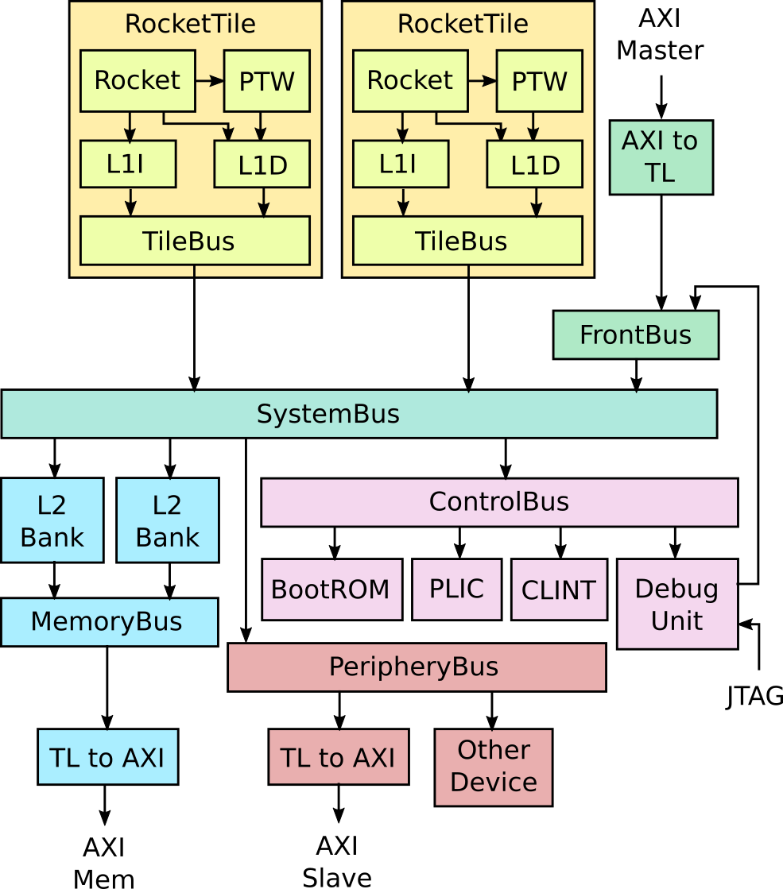

# Rocket Chip

Rocket Chip 生成器是 Berkeley 和 SiFive 开发的 SoC 生成器，现在在 Chips Alliance 中公开维护。Chipyard 使用 Rocket Chip 生成器作为生产 RISC-V SoC 的基础。

Rocket Chip 与 Rocket core 不同，Rocket core 是顺序 RISC-V CPU 生成器。Rocket Chip除了 CPU 之外还包括 SoC 的很多部分。尽管 Rocket Chip 默认使用 Rocket core CPU，但它也可以配置为使用 BOOM 乱序核心生成器或其他一些自定义 CPU 生成器。

典型 Rocket Chip 系统的详细框图如下所示。

## Tiles

该图显示了双核 `Rocket` 系统。每个 `Rocket` 核心都与页表遍历器、L1 指令缓存和 L1 数据缓存组合到 `RocketTile` 中。

`Rocket` 核心也可以更换为 `BOOM` 核心。每个区块还可以配置一个 RoCC 加速器，该加速器作为协处理器连接到核心。

## Memory System

这些块连接到 `SystemBus`，系统总线将其连接到 L2 缓存组。然后，L2 缓存组连接到 `MemoryBus`，后者通过 TileLink 到 AXI 转换器连接到 DRAM 控制器。

要了解有关内存层次结构的更多信息，请参阅 [Memory Hierarchy](https://chipyard.readthedocs.io/en/stable/Customization/Memory-Hierarchy.html#memory-hierarchy)。

## MMIO

对于 MMIO 外设，`SystemBus` 连接到 `ControlBus` 和 `PeripheryBus`。

`ControlBus` 连接标准外设，如 BootROM、平台级中断控制器 (PLIC)、内核本地中断 (CLINT) 和调试单元。

BootROM 包含第一阶段引导加载程序，即系统退出复位后运行的第一条指令。它还包含设备树，Linux 使用它来确定连接的其他外围设备。

PLIC 聚合并屏蔽设备中断和外部中断。

内核本地中断包括每个 CPU 的软件中断和定时器中断。

调试单元用于对芯片进行外部控制。它可用于将数据和指令加载到内存或从内存中提取数据。它可以通过自定义 DMI 或标准 JTAG 协议进行控制。

`PeripheryBus` 连接额外的外围设备，例如 NIC 和块设备。它还可以选择公开外部 AXI4 端口，该端口可以连接到供应商提供的 AXI4 IP。

要了解有关添加 MMIO 外设的更多信息，请查看 [MMIO Peripherals](https://chipyard.readthedocs.io/en/stable/Customization/MMIO-Peripherals.html#mmio-accelerators) 部分。

## DMA

您还可以添加直接从内存系统读写的 DMA 设备。它们附加到 `FrontendBus`。 `FrontendBus` 还可以通过 AXI4 到 TileLink 转换器连接供应商提供的 AXI4 DMA 设备。

要了解有关添加 DMA 设备的更多信息，请参阅 [Adding a DMA Device](https://chipyard.readthedocs.io/en/stable/Customization/DMA-Devices.html#dma-devices) 部分。