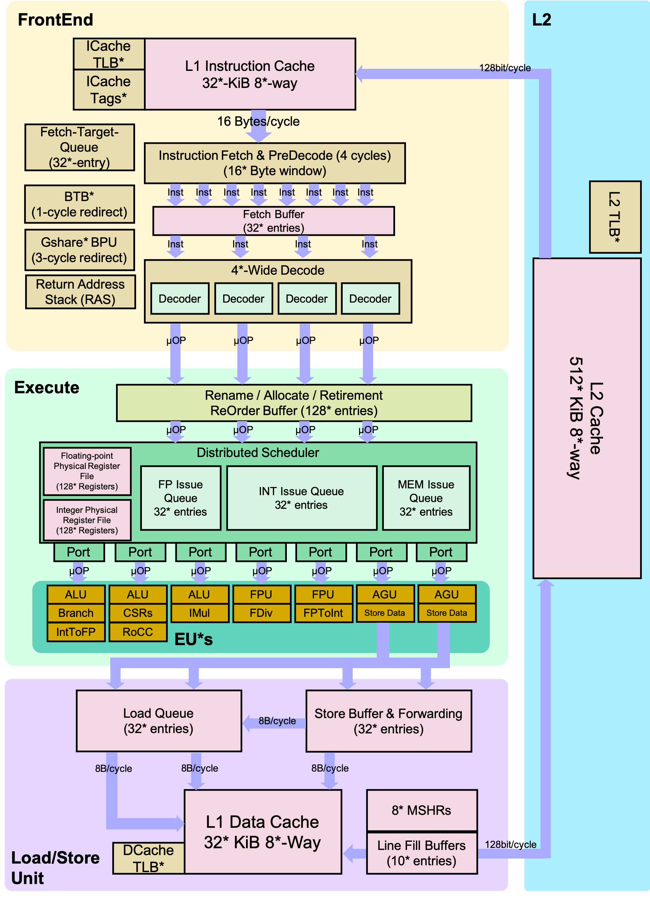

# Berkeley Out-of-Order Machine (BOOM)

[Berkeley Out-of-Order Machine (BOOM)](https://boom-core.org/) 是一个可综合且可参数化的开源 RV64GC RISC-V 核，采用 Chisel 硬件构造语言编写。它可以作为 Rocket Chip 提供的 Rocket 核心的直接替代品（用 BoomTile 替代 RocketTile）。 BOOM 深受 MIPS R10k 和 Alpha 21264 乱序处理器的启发。与 R10k 和 21264 一样，BOOM 是统一的物理寄存器文件设计（也称为“显式寄存器重命名”）。从概念上讲，BOOM 分为 10 个阶段：Fetch、Decode、Register Rename、Dispatch、Issue、Register Read、Execute、Memory、Writeback 和 Commit。 然而，许多这些阶段在当前的实现中组合在一起，产生七个阶段：Fetch、Decode/Rename、Rename/Dispatch、Issue/RegisterRead、Execute、Memory 和 Writeback（提交是异步发生的，因此它不被算作“流水线”）。

有关 BOOM 微架构的其他信息可以在 [BOOM documentation pages](https://docs.boom-core.org/)中找到。