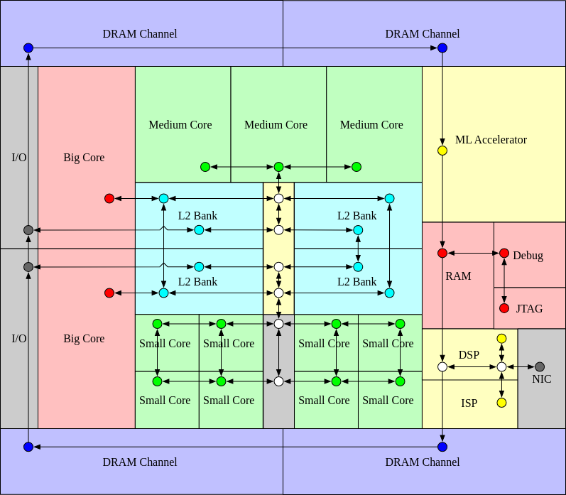

# Constellation

[Constellation](https://github.com/ucb-bar/constellation) 是一个 Chisel NoC RTL 生成器框架，从头开始设计，支持异构 SoC 中的集成以及高度不规则的 NoC 架构的评估。

1. Constellation 生成具有虚拟网络和基于信用的流量控制的数据包交换虫洞路由网络。
2. Constellation 支持任意有向图网络拓扑，包括不规则和分层网络拓扑。
3. Constellation 包括路由算法验证器和路由表编译器，可以验证并生成任意拓扑的无死锁路由表。
4. Constellation 是一个独立于协议的传输层，但能够兼容 AXI-4 和 TileLink 等协议的无死锁传输。
5. Constellation 支持在 Chipyard/Rocketchip SoC 中直接集成
6. Constellation 经过严格测试，在多种网络配置中进行了近 100 次不同的测试

Constellation 完全集成到 Chipyard 中，可用于在基于 Chipyard/Rocketchip 的 SoC 中生成几乎任何互连。

有关 Constellation 的文档，请参阅其 [documentation pages](http://constellation.readthedocs.io/)。