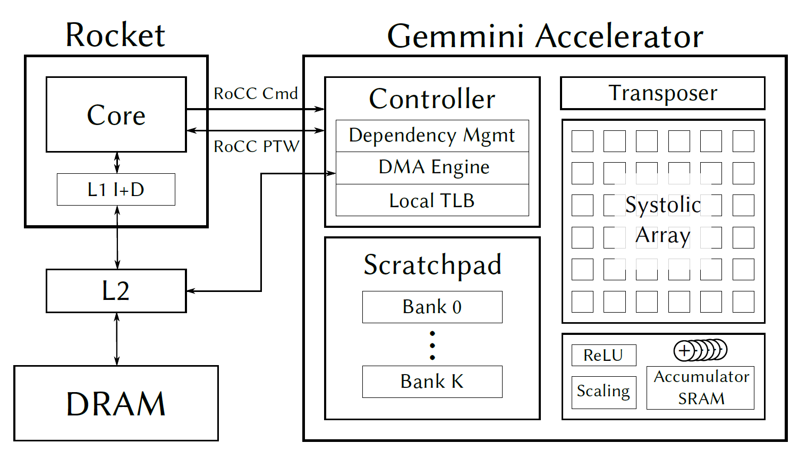

# Gemmini

Gemmini 项目正在开发一个全系统、全栈的 DNN 硬件探索和评估平台。 Gemmini 使架构师能够深入了解系统和软件堆栈的不同组件（除了加速器本身之外）如何相互作用以影响整体 DNN 性能。

查看 [Gemmini’s documentation](https://github.com/ucb-bar/gemmini/blob/master/README.md)，了解如何使用 Gemmini 和 Chipyard 生成、模拟和分析 DNN 加速器。

