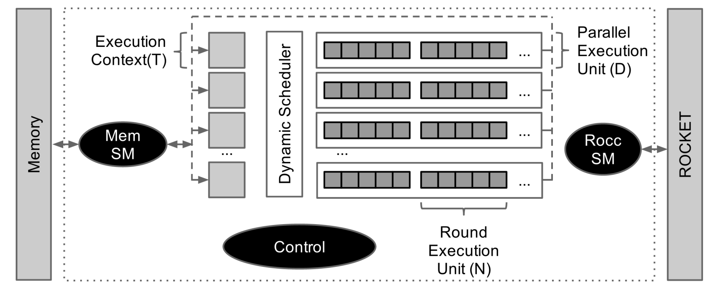

# SHA3 RoCC Accelerator

SHA3​​ 加速器是 SHA3 哈希算法的基本 RoCC 加速器。我们喜欢在 Chipyard 教程内容中使用 SHA3，因为它是将自定义加速器集成到 Chipyard 的独立、简单的示例。

## Introduction

安全散列算法代表一类散列函数，它提供四个属性：易于散列计算、无法从散列生成消息（单向属性）、无法更改消息而不更改散列（弱冲突自由属性）、并且无法找到具有相同哈希值的两条消息（强无冲突属性）。美国国家标准与技术研究院 (NIST) 最近举办了一场竞赛，要求将一种新算法添加到其安全哈希算法 (SHA) 中。 2012 年，Keccak 哈希函数被确定为获胜者，并建立了 SHA3 的粗略规范。该算法使用海绵函数对可变长度消息进行操作，从而在将消息块吸收到一组状态位和排列状态之间交替。吸收是一个简单的按位异或，而排列是一个更复杂的函数，由多个操作 χ、θ、ρ、π、ι 组成，它们都执行各种按位操作，包括旋转、奇偶校验计算、异或等。 Keccak 哈希函数针对不同大小的状态和消息块进行参数化，但对于此加速器，我们仅支持具有 1600 位状态和 1088 位消息块的 Keccak-256 变体。 SHA3​​加速器的示意图如下所示。



## Technical Details

该加速器围绕三个子系统设计：与处理器的接口、与存储器的接口以及实际的哈希计算系统。与处理器的接口是使用 ROCC 接口设计的，用于与 RISC-V Rocket/BOOM 处理器集成的协处理器。它包括将两个 64 位字传输到协处理器的能力、对返回值的请求以及所请求功能的小字段。加速器使用就绪/有效接口接收这些请求。 ROCC 指令被解析，所需信息被存储到执行上下文中。执行上下文包含正在散列的消息的内存地址、存储散列结果的内存地址、消息的长度以及其他几个控制字段。

一旦执行上下文有效，内存子系统就会开始获取消息块。内存子系统与其他子系统完全解耦，并维护单个整轮内存缓冲区。加速器内存接口每个周期最多可提供一个 64 位字，对应于填充缓冲区所需的 17 个请求（大小由 SHA3 算法决定）。填充这些缓冲区的内存请求以内存接口可以处理的速度发送出去，并设置一个标记字段以允许区分不同的内存缓冲区请求，因为它们可能会乱序返回。一旦内存子系统填充了缓冲区，控制单元就会将该缓冲区吸收到执行上下文中，此时执行上下文可以自由地开始排列，并且内存缓冲区可以自由地发送更多内存请求。

缓冲区被吸收后，哈希计算子系统开始排列操作。一旦消息被完全散列，散列就会通过简单的状态机写入内存。

## Using a SHA3 Accelerator

由于 SHA3 加速器被设计为 RoCC 加速器，因此可以通过覆盖 BuildRoCC 密钥将其混合到 Rocket 或 BOOM 核心中。配置片段在 SHA3 生成器中定义。此处显示了突出显示此配置片段的使用的示例配置：

```Scala
class Sha3RocketConfig extends Config(
  new sha3.WithSha3Accel ++                                // add SHA3 rocc accelerator
  new freechips.rocketchip.subsystem.WithNBigCores(1) ++
  new chipyard.config.AbstractConfig)
```

SHA3​​ 示例裸机和 Linux 测试位于 SHA3 存储库中。有关如何运行/构建测试的更多信息，请参阅其 [README.md](https://github.com/ucb-bar/sha3/blob/master/README.md)。


