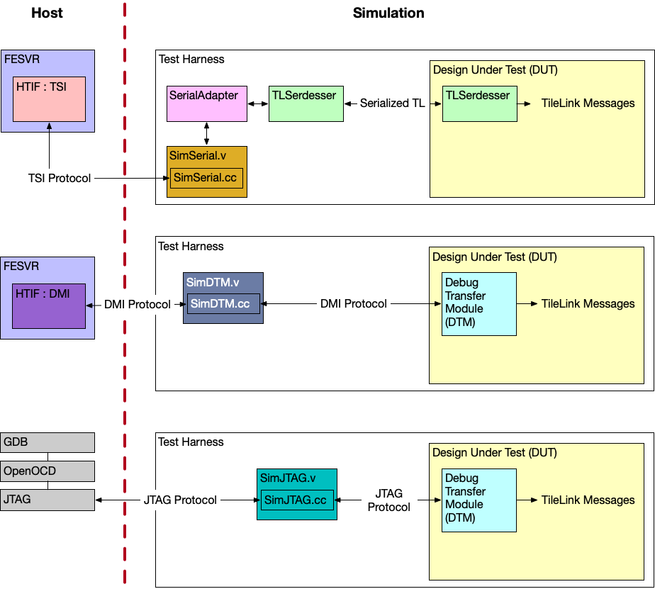
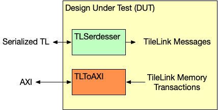
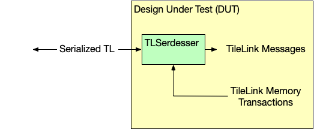
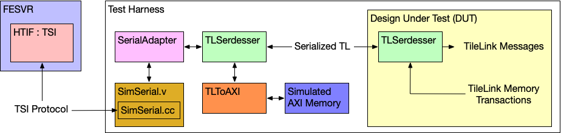
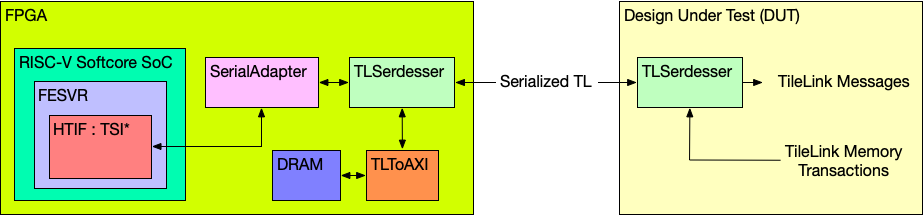

# Communicating with the DUT

可以制作两种类型的 DUT：驻留 DUT 或独立 DUT。驻留 DUT 是主机（或只是主机）必须向 DUT 发送事务以启动程序的地方。这与可以自行启动的独立 DUT 不同（具有自己的 bootrom、自行加载程序等）。驻留 DUT 的一个示例是 Chipyard 仿真，其中主机将测试程序加载到 DUT 内存中，并向 DUT 发出程序已准备好运行的信号。独立 DUT 的一个示例是 Chipyard 仿真，其中可以在复位状态下从 SDCard 加载程序。在本节中，我们主要描述如何与驻留 DUT 进行通信。

主机（也称为外部世界）可以通过两种方式与驻留的 Chipyard DUT 进行通信：

1. 使用驻留串行接口 (TSI) 或调试模块接口 (DMI) 与前端服务器 (FESVR) 与 DUT 进行通信。
2. 使用 JTAG 接口与 OpenOCD 和 GDB 与 DUT 进行通信。

下图显示了主机和仿真之间所有支持的通信机制的框图视图。



## Using the Tethered Serial Interface (TSI) or the Debug Module Interface (DMI)

如果您使用 TSI 或 DMI 与 DUT 通信，则可以使用前端服务器 (FESVR) 来促进主机与 DUT 之间的通信。

### Primer on the Front-End Server (FESVR)

FESVR 是一个 C++ 库，用于管理主机和 RISC-V DUT 之间的通信。为了进行调试，它提供了一个简单的 API 来重置、发送消息以及在 DUT 上加载/运行程序。它还模拟外围设备。它可以与仿真器（VCS、Verilator、FireSim）结合使用，或者用于流片芯片的启动序列中。

具体来说，FESVR 使用主机目标接口 (HTIF)（一种通信协议）与 DUT 进行通信。 HTIF 是一种非标准 Berkeley 协议，使用 FIFO 非阻塞接口与 DUT 进行通信。它定义了一个协议，您可以在其中读/写内存、加载/启动/停止程序等等。 TSI 和 DMI 都以不同的方式实现该 HTIF 协议，以便与 DUT 进行通信。

### Using the Tethered Serial Interface (TSI)

默认情况下，Chipyard 使用驻留串行接口 (TSI) 与 DUT 进行通信。TSI 协议是 HTIF 的实现，用于向 RISC-V DUT 发送命令。这些 TSI 命令是简单的 R/W 命令，能够访问 DUT 的存储空间。在仿真过程中，主机将 TSI 命令发送到测试工具中名为 `SimTSI`（C++ 类）的仿真存根，该存根驻留在 `SimTSI` Verilog 模块中（两者都位于 `generators/testchipip` 项目中）。然后，该 `SimTSI` Verilog 模块将模拟存根接收到的 TSI 命令发送到适配器，适配器将 TSI 命令转换为 TileLink 请求。此转换由 `TSIToTileLink` 模块（位于 `generators/testchipip` 项目中）完成。事务转换为 TileLink 后，`TLSerdesser`（位于 `generators/testchipip` 中）序列化事务并将其发送到芯片（此 `TLSerdesser` 有时也称为数字串行链路或 SerDes）。一旦芯片上接收到序列化事务，它就会被反序列化并控制芯片上处理请求的 TileLink 总线。在仿真中，FESVR 复位 DUT，将测试程序写入内存，并通过中断指示 DUT 启动程序（参见 [Chipyard Boot Process](https://chipyard.readthedocs.io/en/stable/Customization/Boot-Process.html#chipyard-boot-process)）。使用 TSI 是目前在仿真中与 DUT 通信最快的机制（与 DMI/JTAG 相比），FireSim 也使用这种机制。

### Using the Debug Module Interface (DMI)

与 DUT 连接的另一个选项是使用调试模块接口 (DMI)。与 TSI 类似，DMI 协议是 HTIF 的实现。为了通过 DMI 协议与 DUT 进行通信，DUT 需要包含调试传输模块 (DTM)。DTM 在 [RISC-V Debug Specification](https://riscv.org/specifications/debug-specification/) 中给出，负责管理 DUT 与 DMI 另一侧的任何设备（在本例中为 FESVR）之间的通信。这是通过具有 `HasPeripheryDebug` 和 `HasPeripheryDebugModuleImp` traits 在 Rocket Chip 子系统中实现的。在仿真过程中，主机将 DMI 命令发送到名为 `SimDTM`（C++ 类）的仿真存根，该存根位于 `SimDTM` Verilog 模块中（两者都位于 `generators/rocket-chip` 项目中）。然后，该 `SimDTM` Verilog 模块将仿真存根接收到的 DMI 命令发送到 DUT，然后 DUT 将 DMI 命令转换为 TileLink 请求。此转换由 `generators/rocket-chip` 项目中名为 `DebugModule` 的 DTM 完成。当 DTM 接收到要加载的程序时，它开始将二进制字节写入内存。这比直接将程序二进制写入内存的 TSI 协议通信管道（即 `SimTSI`/`TSIToTileLink`/TileLink）慢得多。

### Starting the TSI or DMI Simulation

所有默认的 Chipyard 配置都使用 TSI 在仿真和仿真 SoC/DUT 之间进行通信。因此，当运行软件 RTL 仿真时，如 [Software RTL Simulation](https://chipyard.readthedocs.io/en/stable/Simulation/Software-RTL-Simulation.html#software-rtl-simulation) 部分所示，您实际上是在使用 TSI 与 DUT 进行通信。提醒一下，要运行软件 RTL 模拟，请运行：

```shell
cd sims/verilator
# or
cd sims/vcs

make CONFIG=RocketConfig run-asm-tests
```

如果您想要使用配置为 DMI 通信的 DTM 来构建和模拟 Chipyard 配置，则必须绑定串行链路接口，并实例化 SimDTM。

```Scala
class dmiRocketConfig extends Config(
  new chipyard.harness.WithSerialTLTiedOff ++                    // don't attach anything to serial-tl
  new chipyard.config.WithDMIDTM ++                              // have debug module expose a clocked DMI port
  new freechips.rocketchip.subsystem.WithNBigCores(1) ++
  new chipyard.config.AbstractConfig)
```

然后，您可以使用新的启用 DMI 的顶层和测试工具运行模拟。

```shell
cd sims/verilator
# or
cd sims/vcs

make CONFIG=dmiRocketConfig run-asm-tests
```

## Using the JTAG Interface

与 DUT 连接的另一种方法是使用 JTAG。与 [Using the Debug Module Interface (DMI)](https://chipyard.readthedocs.io/en/stable/Advanced-Concepts/Chip-Communication.html#using-the-debug-module-interface-dmi) 部分类似，为了使用 JTAG 协议，DUT 需要包含配置为使用 JTAG 而不是 DMI 的调试传输模块 (DTM)。一旦 JTAG 端口公开，主机就可以通过驻留在 `SimJTAG` Verilog 模块（均驻留在 `generators/rocket-chip` 项目中）中的名为 `SimJTAG`（C++ 类）的仿真存根，通过 JTAG 与 DUT 进行通信。该仿真存根创建一个套接字，当模拟运行时，OpenOCD 和 GDB 可以连接到该套接字。默认 Chipyard 设计实例化配置为使用 JTAG（即 `RocketConfig`）的 DTM。

> **注意**：如前所述，默认的 Chipyard 设计是通过 JTAG 启用的。然而，如果不使用 JTAG 接口，他们也会使用带有 FESVR 的 TSI/Serialized-TL。这允许用户选择如何与 DUT 通信（使用 TSI 或 JTAG）。

### Debugging with JTAG

仿真中使用 JTAG 进行调试的大致步骤如下：

1. 构建 Chipyard 支持 JTAG 的 RTL 设计。请记住，默认的 Chipyard 设计已准备好 JTAG。

```shell
cd sims/verilator
# or
cd sims/vcs

make CONFIG=RocketConfig
```
2. 在启用 remote bit-bang 的情况下运行仿真。由于我们希望使用 JTAG 加载/运行二进制文件，因此我们可以传递 `none` 作为二进制文件（防止 FESVR 加载程序）。 （改编自：https://github.com/chipsalliance/rocket-chip#3-launch-the-emulator）。

```shell
# note: this uses Chipyard make invocation to run the simulation to properly wrap the simulation args
make CONFIG=RocketConfig BINARY=none SIM_FLAGS="+jtag_rbb_enable=1 --rbb-port=9823" run-binary
```

3. [按照此处的说明使用 OpenOCD + GDB 连接到仿真](https://github.com/chipsalliance/rocket-chip#4-launch-openocd)。

> **注意**：本节改编自 Rocket Chip 和 riscv-isa-sim 中的指令。有关更多信息，请参阅该文档：[Rocket Chip GDB Docs](https://github.com/chipsalliance/rocket-chip#-debugging-with-gdb)、[riscv-isa-sim GDB Docs](https://github.com/riscv/riscv-isa-sim#debugging-with-gdb)。

## Example Test Chip Bringup Communication

### Intro to Typical Chipyard Test Chip

大多数（如果不是全部）Chipyard 配置都使用 TSI（通过串行链路）进行连接，并可以通过 AXI 端口（支持 AXI 内存）访问外部内存。下图显示了具有这组默认信号的 DUT：



在此设置中，串行链路连接到 TSI/FESVR 外设，而 AXI 端口连接到仿真 AXI 存储器。然而，AXI 端口往往有许多信号，因此也有与其关联的电线，因此无需在 DUT 上创建 AXI 端口，而是可以通过双向串行链路 (`TLSerdesser`) 发送内存事务，以便主接口连接 DUT 的是串行链路（其信号比 AXI 端口相对较少）。这个新设置（如下所示）是典型的 Chipyard 测试芯片设置：



### Simulation Setup of the Example Test Chip

标准测试芯片启动程序通过序列化 tilelink 将芯片连接到FPGA 配置。



整个启动过程可以使用 Multi-ChipTop 仿真功能进行仿真，其中一个 `ChipTop` 是待流片设计，而另一个是 FPGA 启动设计。

可以使用以下示例配置来生成和仿真该系统，该配置将 `ChipLikeRocketConfig`（要流片的设计）与 `ChipBringupHostConfig`（FPGA 启动设计）结合起来。

```Scala
class TetheredChipLikeRocketConfig extends Config(
  new chipyard.harness.WithAbsoluteFreqHarnessClockInstantiator ++   // use absolute freqs for sims in the harness
  new chipyard.harness.WithMultiChipSerialTL(0, 1) ++                // connect the serial-tl ports of the chips together
  new chipyard.harness.WithMultiChip(0, new ChipLikeRocketConfig) ++ // ChipTop0 is the design-to-be-taped-out
  new chipyard.harness.WithMultiChip(1, new ChipBringupHostConfig))  // ChipTop1 is the bringup design
```

### Softcore-driven Bringup Setup of the Example Test Chip after Tapeout

> **警告**：不鼓励使用此处描述的 FPGA 软核来启动测试芯片。另一种使用 FPGA 在主机和测试芯片之间“桥接”的方法是首选方法。

假设此示例测试芯片已流片并准备好进行测试，我们可以使用此串行链路与芯片进行通信。例如，伯克利用于评估基于 Chipyard 的测试芯片的常见测试设置包括运行 RISC-V 软核的 FPGA，该软核能够与 DUT 通信（通过 FMC）。该 RISC-V 软核将充当在 DUT 上运行的测试的主机。这是通过运行 FESVR 的 RISC-V 软核来完成的，将 TSI 命令发送到 FPGA 上编程的 `TSIToTileLink` / `TLSerdesser`。一旦命令被转换为序列化的 TileLink，它们就可以通过某种介质发送到 DUT（例如 FMC 电缆或一组将 FPGA 输出连接到 DUT 板的电线）。与仿真类似，如果芯片请求片外存储器，则它可以通过串行链路将事务发送回。然后 FPGA DRAM 即可处理该请求。下图显示了此流程：



事实上，下一节将讨论这种确切类型的启动设置： ref:_legacy-vcu118-bringup。